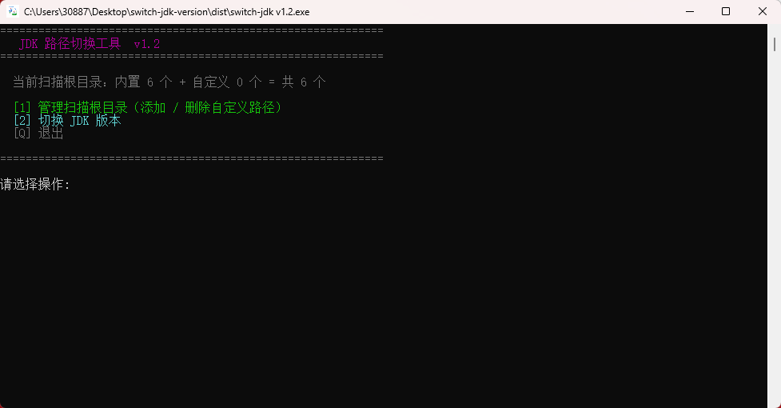
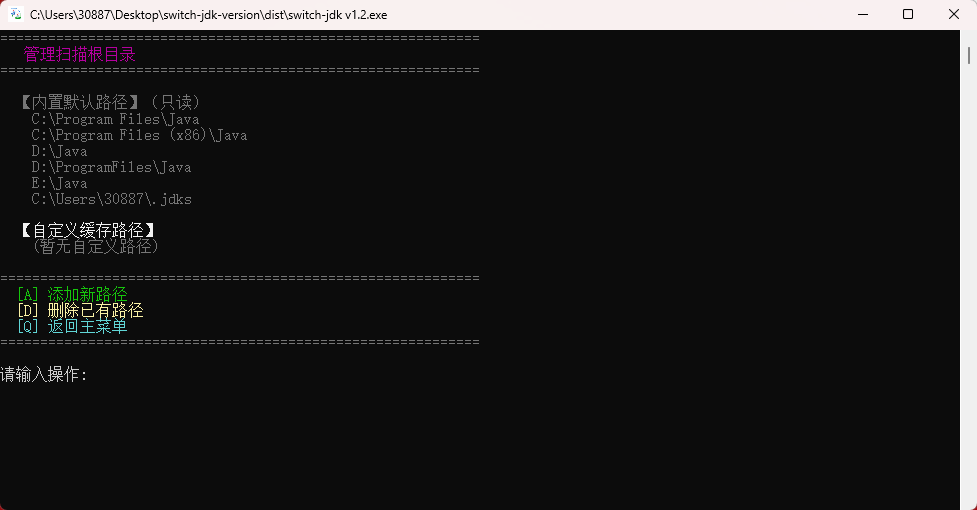
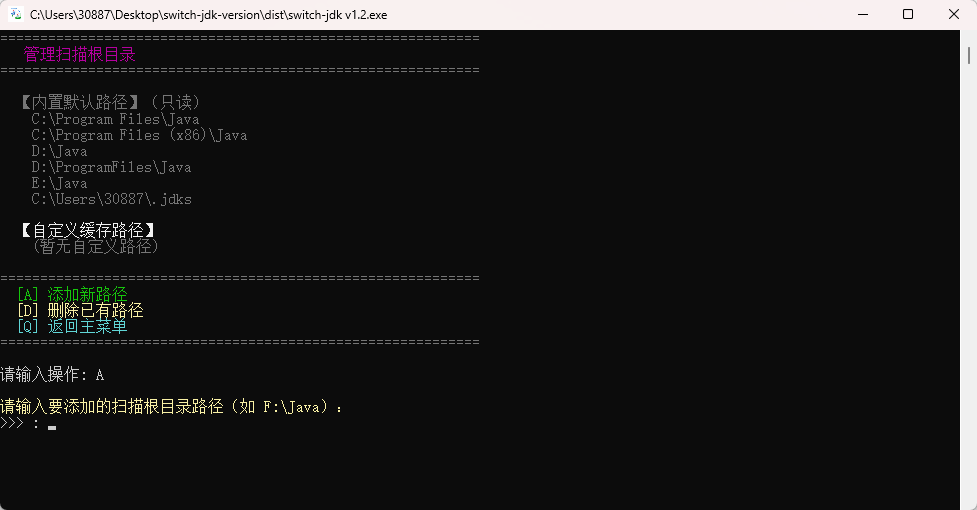
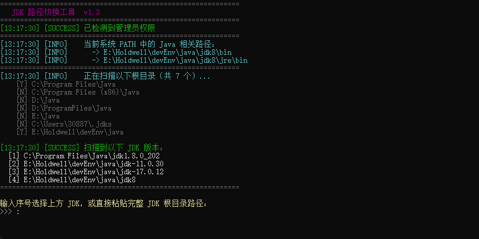

<div align="center">
<h1>JDK 版本一键切换工具</h1>
</div>

---

在 Windows 系统上快速切换 JDK 版本，自动扫描已安装的 JDK、更新系统 PATH 和 JAVA_HOME，无需手动操作环境变量。

## 功能特性

- **主菜单交互** — 启动后进入主菜单，选择管理扫描路径或直接切换 JDK
- **自定义扫描根目录** — 支持添加/删除自定义扫描路径，永久缓存到本地，下次启动自动读取
- **自动扫描 JDK** — 在内置目录和自定义目录中自动发现所有已安装的 JDK
- **手动输入路径** — 扫描不到时，支持直接粘贴任意 JDK 根目录路径
- **精确更新 PATH** — 仅替换 Machine 级别的旧 JDK/JRE 条目，不触碰 User PATH
- **一键设置 JAVA_HOME** — 自动更新系统级 JAVA_HOME 环境变量
- **即时生效** — 当前会话立即生效，新开终端窗口也会自动读取新系统 PATH
- **安全校验** — 切换前验证路径和 java.exe 是否存在，切换后执行 `java -version` 确认

## 文件说明

| 文件 | 作用 |
|------|------|
| `switch-jdk.bat` | 启动器，自动申请管理员权限并调用 PowerShell 脚本 |
| `switch-jdk.ps1` | 主脚本，负责扫描、选择、更新 PATH 和 JAVA_HOME |
| `build.ps1` | 打包脚本，将 ps1 编译为可直接双击运行的 exe |
| `icon.ico` | 程序图标（编译 exe 时嵌入） |

> 缓存文件保存在：`%APPDATA%\switch-jdk\jdk-roots-cache.json`，不随代码提交。

## 使用方式

### 方式一：直接运行脚本

右键 `switch-jdk.bat`，选择 **"以管理员身份运行"**（脚本也会自动请求提权）。

### 方式二：编译为 EXE 运行

```powershell
# 以管理员身份在 PowerShell 中执行
.\build.ps1
```

生成 `dist\switch-jdk.exe`，双击即可运行，自动弹出 UAC 管理员授权。

---

## 操作步骤

### Step 1 — 启动主菜单

启动后显示主菜单，提示当前内置扫描根目录数量和自定义数量。



选择操作：
- 输入 `1` — 进入扫描根目录管理
- 输入 `2` — 直接开始扫描并切换 JDK
- 输入 `Q` — 退出

---

### Step 2 — 管理扫描根目录

进入后可查看内置默认路径（只读）和当前已缓存的自定义路径。



操作说明：

| 输入 | 操作 |
|------|------|
| `A`  | 添加新的扫描根目录 |
| `D`  | 按序号删除已有的自定义路径 |
| `Q`  | 返回主菜单 |

---

### Step 3 — 添加自定义扫描路径

输入 `A` 后，粘贴或输入你的 JDK 安装根目录（不是 JDK 本身，而是存放多个 JDK 的父目录）。



例如你的 JDK 安装在 `E:\Holdwell\devEnv\java\jdk8`，则添加 `E:\Holdwell\devEnv\java`。

路径会立即持久化到本地缓存，下次启动自动加载。

---

### Step 4 — 扫描并选择 JDK 版本

在主菜单选择 `2`，脚本扫描所有根目录（内置 + 自定义），列出发现的所有 JDK。



- `[Y]` 表示该根目录存在，`[N]` 表示不存在（跳过）
- 输入序号选择对应 JDK，或直接粘贴完整 JDK 根目录路径

脚本将自动完成：
1. 移除旧 JDK 的 PATH 条目
2. 将新 JDK 的 `bin` 插入 PATH 最前面
3. 更新系统 `JAVA_HOME`
4. 执行 `java -version` 验证切换结果

---

## 内置扫描目录

| 目录 |
|------|
| `C:\Program Files\Java` |
| `C:\Program Files (x86)\Java` |
| `D:\Java` |
| `D:\ProgramFiles\Java` |
| `E:\Java` |
| `%USERPROFILE%\.jdks` |

如果你的 JDK 安装在其他位置，通过主菜单 **[1] 管理扫描根目录** 添加即可。

## 注意事项

- 修改系统环境变量需要 **管理员权限**，启动时会自动申请
- 扫描逻辑：在根目录下查找名称以 `jdk` 开头且包含 `bin\java.exe` 的子目录
- 脚本只操作 **Machine 级别 PATH**，User PATH 完整保留，不受影响
- 切换后新开的命令窗口自动生效；当前窗口也会立即同步