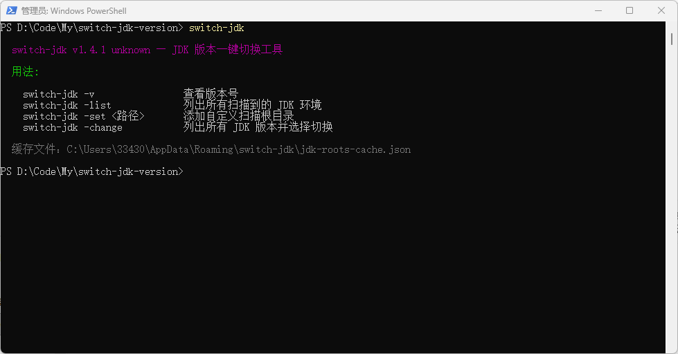
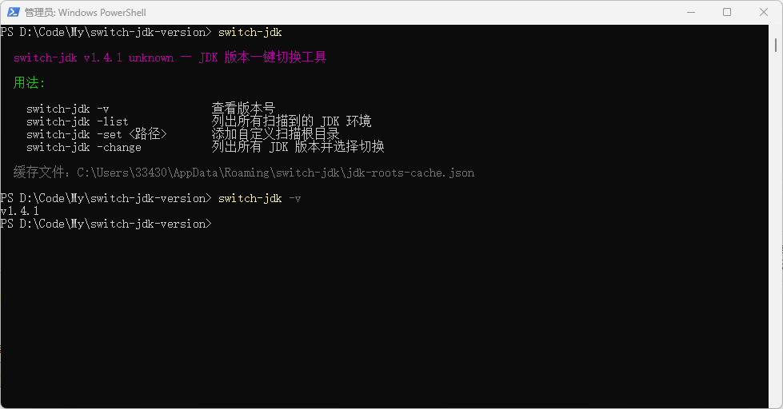
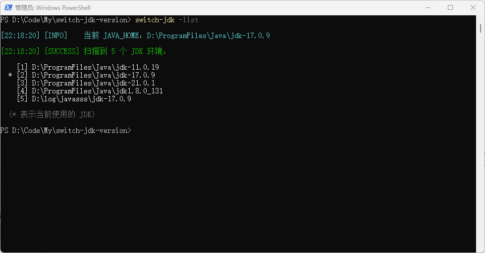
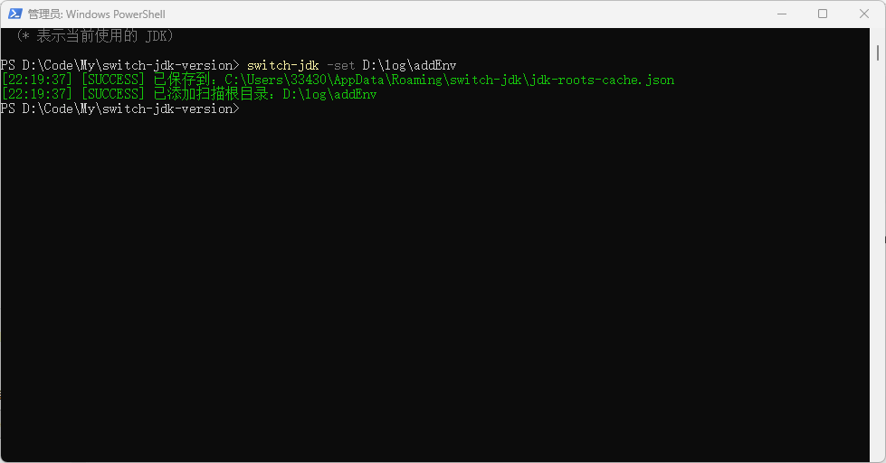
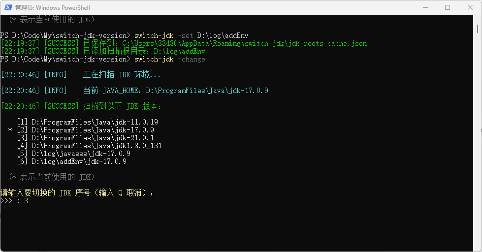
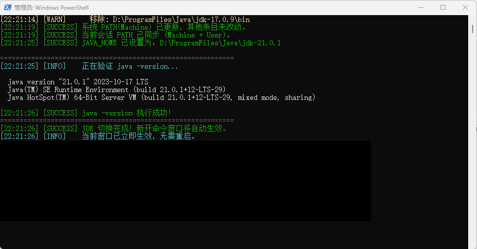

<h1 align="center">JDK 版本一键切换工具</h1>

---

快速切换 JDK 版本，自动扫描已安装的 JDK、更新系统 PATH 和 JAVA_HOME，无需手动操作环境变量。**支持 Windows、macOS、Linux 三平台。**

## 快速安装（推荐）

```bash
npm install -g switch-jdk-version
```

安装完成后，在终端输入 `switch-jdk` 即可使用。

> **需要管理员/sudo 权限** — 切换 JDK 时会修改系统环境变量，Windows 需要以管理员身份运行终端，macOS/Linux 会在需要时请求 sudo。

---

## 命令一览

| 命令 | 功能 |
|------|------|
| `switch-jdk` | 显示帮助信息 |
| `switch-jdk -v` | 查看当前版本号 |
| `switch-jdk -list` | 列出所有扫描到的 JDK 环境 |
| `switch-jdk -set <路径>` | 添加自定义扫描根目录（持久化缓存） |
| `switch-jdk -change` | 列出所有 JDK 版本并选择切换 |

---

## 操作步骤（Windows 截图示例）

### Step 1 — 启动

在终端输入 `switch-jdk`，显示帮助信息与可用命令。



---

### Step 2 — 查看版本

```powershell
switch-jdk -v
```

显示当前安装的 switch-jdk 版本号。



---

### Step 3 — 列出 JDK 环境

```powershell
switch-jdk -list
```

扫描所有已配置的根目录（内置 + 自定义），列出发现的全部 JDK 环境。`*` 号标记当前正在使用的 JDK。



---

### Step 4 — 添加扫描根目录

```powershell
switch-jdk -set <JDK 安装父目录>
```

将你的 JDK 安装根目录添加到扫描缓存。例如你的 JDK 安装在 `E:\Holdwell\devEnv\java\jdk8`，则添加 `E:\Holdwell\devEnv\java`。



路径会立即持久化到本地缓存，下次使用 `-list` 或 `-change` 时自动加载。

---

### Step 5 — 切换 JDK 版本

```powershell
switch-jdk -change
```

列出所有扫描到的 JDK，输入序号选择要切换的版本（输入 `Q` 取消）。



脚本将自动完成：
1. 移除旧 JDK 的 PATH 条目
2. 将新 JDK 的 `bin` 插入 PATH 最前面
3. 更新系统 `JAVA_HOME`
4. 执行 `java -version` 验证切换结果

---

### 切换完成后

切换成功后显示新的 JAVA_HOME 和 java 版本信息。



> **注意**：截图中当前窗口执行 `java -version` 显示的版本可能不是最新切换的版本，这是因为当前 PowerShell 会话缓存了旧的 PATH。**新开的命令窗口会自动生效**，或者执行 `refreshenv`（若已安装 Chocolatey）刷新当前会话。

---

## 文件说明

| 文件 | 平台 | 作用 |
|------|------|------|
| `package.json` | 全平台 | npm 包配置，定义 CLI 命令 `switch-jdk` |
| `bin/switch-jdk.js` | 全平台 | Node.js CLI 入口，检测 OS 并委托执行对应脚本 |
| `scripts/switch-jdk.ps1` | Windows | 主脚本，负责扫描、选择、更新 PATH 和 JAVA_HOME |
| `scripts/switch-jdk.sh` | macOS / Linux | 主脚本，功能与 Windows 版完全对等 |
| `build.ps1` | Windows | 打包脚本，将 ps1 编译为可双击运行的 exe |
| `build-unix.sh` | macOS / Linux | 打包脚本，支持 shc 编译为二进制或打包为 tar.gz |
| `icon.ico` | Windows | 程序图标（编译 exe 时嵌入） |

> **Windows** 缓存文件：`%APPDATA%\switch-jdk\jdk-roots-cache.json`
> **macOS/Linux** 缓存文件：`~/.config/switch-jdk/custom-roots.txt`

---

## Windows 使用方式

### 方式一：npm 全局安装（推荐）

```powershell
npm install -g switch-jdk-version
```

安装后在 **管理员身份运行的** PowerShell 或 CMD 中输入：

```powershell
switch-jdk -change
```

### 方式二：直接运行脚本

以管理员身份打开 PowerShell，执行：

```powershell
.\scripts\switch-jdk.ps1 -change
```

### 方式三：编译为 EXE 运行

```powershell
# 以管理员身份在 PowerShell 中执行
.\build.ps1
```

生成 `dist\switch-jdk.exe`，双击即可运行，自动弹出 UAC 管理员授权。

### Windows 内置扫描目录

| 目录 |
|------|
| `C:\Program Files\Java` |
| `C:\Program Files (x86)\Java` |
| `D:\Java` |
| `D:\ProgramFiles\Java` |
| `E:\Java` |
| `%USERPROFILE%\.jdks` |

如果你的 JDK 安装在其他位置，通过 `switch-jdk -set <路径>` 添加即可。

---

## macOS 使用方式

### 方式一：npm 全局安装（推荐）

```bash
npm install -g switch-jdk-version
```

安装后直接输入：

```bash
switch-jdk -change
```

### 方式二：直接运行脚本

```bash
bash scripts/switch-jdk.sh -change
```

切换 JDK 时会请求 `sudo` 权限（用于写入 `/etc/profile.d/switch-jdk.sh`），同时也会更新 `~/.zshrc` 或 `~/.bashrc`。

### 方式三：打包为可执行文件

```bash
# 安装 shc（可选，用于编译为二进制）
brew install shc

# 执行打包
bash build-unix.sh
```

- 若已安装 `shc`：生成 `dist/switch-jdk-mac`（二进制，直接双击或 `./switch-jdk-mac` 运行）
- 同时生成 `dist/switch-jdk-mac-v{版本号}.tar.gz`（压缩包，包含脚本和二进制，可直接分发）

### macOS 内置扫描目录

| 目录 | 说明 |
|------|------|
| `/Library/Java/JavaVirtualMachines` | Oracle / Adoptium / Temurin 等标准安装位置 |
| `~/Library/Java/JavaVirtualMachines` | 用户级 JDK |
| `/usr/local/opt` | Homebrew（Intel Mac） |
| `/opt/homebrew/opt` | Homebrew（Apple Silicon） |
| `~/.sdkman/candidates/java` | SDKMAN 安装的 JDK |
| `~/.jdks` | IntelliJ IDEA 下载的 JDK |

---

## Linux 使用方式

### 方式一：npm 全局安装（推荐）

```bash
npm install -g switch-jdk-version
```

安装后直接输入：

```bash
switch-jdk -change
```

### 方式二：直接运行脚本

```bash
bash scripts/switch-jdk.sh -change
```

### 方式三：打包为可执行文件

```bash
# 安装 shc（可选）
sudo apt install shc      # Debian / Ubuntu
sudo yum install shc      # CentOS / RHEL

# 执行打包
bash build-unix.sh
```

- 若已安装 `shc`：生成 `dist/switch-jdk-linux`
- 同时生成 `dist/switch-jdk-linux-v{版本号}.tar.gz`

### Linux 内置扫描目录

| 目录 | 说明 |
|------|------|
| `/usr/lib/jvm` | 包管理器安装（apt/yum）的 JDK |
| `/usr/local/java` | 手动解压安装 |
| `/usr/local/jdk` | 手动解压安装 |
| `/opt/java` | 企业级安装惯例 |
| `/opt/jdk` | 企业级安装惯例 |
| `~/.sdkman/candidates/java` | SDKMAN 安装的 JDK |
| `~/.jdks` | IntelliJ IDEA 下载的 JDK |

### Linux PATH 生效方式

脚本会同时修改以下两处，确保所有场景生效：

1. `/etc/profile.d/switch-jdk.sh`（系统级，对所有用户生效，需要 sudo）
2. `~/.zshrc` 或 `~/.bashrc`（用户级，当前用户生效）

> **注意**：切换完成后，当前终端已立即生效（`export` 已执行）。新开终端也会自动加载。

---

## 注意事项

- **Windows**：修改系统环境变量需要 **管理员权限**；脚本只操作 Machine 级别 PATH，User PATH 完整保留。切换后需**新开命令窗口**才能看到更新后的 `java -version`。
- **macOS / Linux**：切换时会请求 sudo 权限；同时更新系统级和用户级配置文件；新开终端自动生效，当前终端已立即生效。
- 扫描逻辑：在根目录下查找名称含 `jdk` 且包含 `bin/java`（或 `bin\java.exe`）的子目录。
- 缓存路径通过 `-set` 命令管理，支持重复添加检测和路径存在性校验。
